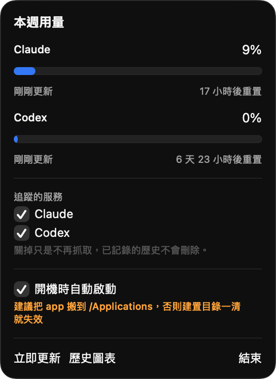
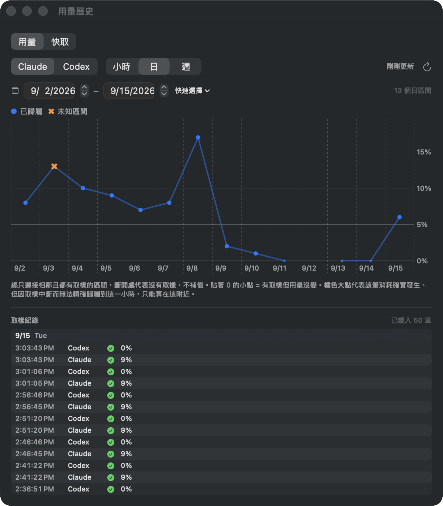
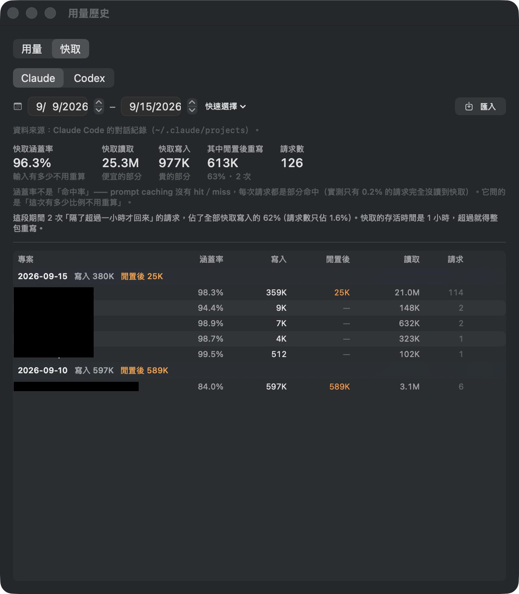

# ai-usage

[繁體中文](README.md) | **English**

A macOS menu bar app that keeps tracking the weekly usage percentage of your **Claude** and **Codex** subscriptions.
Every raw sample is kept permanently in a local SQLite database, so you can look back at hourly / daily / weekly consumption over any range.

> **Unofficial tool.** Not affiliated with or endorsed by Anthropic or OpenAI.
> The usage endpoints this app reads are **undocumented**, and it renews credentials using Claude Code's OAuth client ID —
> either may change or be shut off without notice, and the app will stop working when that happens.
> Personal project with no maintenance guarantee; judge for yourself whether it fits the terms of the services you use.

> **The app UI and the documents under `docs/` are in Traditional Chinese only.**
> UI labels below are quoted in Chinese with a translation, so you can match them on screen.

<p>
  
  
</p>

Click the menu bar icon for this week's usage and reset countdown. "歷史圖表" (History) lets you look back by hour / day / week;
ranges with no samples show as breaks in the line, never filled in.



The "快取" (Cache) tab imports your local conversation logs and lists cache reads, writes, and rewrites after idle, by day and project.

## Who this is for

Subscribers using the **Claude desktop app** and **Codex** (Claude Pro / Max, ChatGPT subscriptions).

**Not a good fit:**
- **Regular `claude` CLI users** — once this app renews the credentials, the CLI's copy becomes invalid, and you will be logged out again and again
  (see [Where credentials come from](#where-credentials-come-from)).
- **Pay-as-you-go API key users** — there is no weekly quota to track.

Neither service offers a public API for subscription usage, so this app borrows your existing login. As a result:

- **Claude still requires installing Claude Code and logging in once**, purely to obtain the initial credentials — the desktop app keeps its login in its own cookies, which can't be read.
- **You only get a percentage and a reset time**, no token counts or cost. The percentage is the account-wide quota, so usage from other devices counts too.
- **The cache tab only covers conversation logs on this Mac**, so it won't line up with the usage percentage. That's expected.
- **macOS only.**

## Requirements

| Item | Version |
|---|---|
| macOS | 14 or later (developed on 26.6) |
| Xcode | 16 or later (developed on 26.6) |
| Claude Code | Installed, and `claude auth login` completed |
| ChatGPT / Codex | Logged in (this app reads `~/.codex/auth.json`) |
| Apple ID | Needed to build; **a free account is enough** (see signing below) |

## Installation

**There is no prebuilt binary to download.** This project is signed with an Apple Development certificate,
which only runs on the signer's own machines; distributing to others requires a Developer ID
certificate ($99/year) and notarization, which this project doesn't plan to do. **Build it yourself.**

### 1. Set up your own signing

The project file **contains no one's team ID** — it reads `Config/Local.xcconfig`, which is
gitignored. Copy the template and fill in your own:

```bash
cp Config/Local.xcconfig.example Config/Local.xcconfig
```

```
AIUSAGE_DEVELOPMENT_TEAM = your 10-character team ID
```

If you haven't added an Apple ID yet: `Xcode → Settings → Accounts → +`. **A free account is enough**;
the paid Developer Program is not required. After adding it, find your team ID with:

```bash
security find-identity -v -p codesigning     # the 10 characters in parentheses
```

> **Use `Config/Local.xcconfig`; don't pick a Team from the dropdown in Xcode's
> Signing & Capabilities.** Picking it in the UI **writes the team ID back into `project.pbxproj`**,
> leaving your git tree with a change that should never be committed.

In the Xcode UI you only need to confirm these two (already set in the project; normally leave them alone):

```
☑ Automatically manage signing
Signing Certificate:  Development        ← not Sign to Run Locally
```

`Sign to Run Locally` is ad-hoc signing; with it selected, the team setting has no effect.

Press ⌘B in Xcode once to build, so it creates the certificate (it will ask for keychain access to store the private key — allow it).
Verify:

```bash
security find-identity -v -p codesigning     # should list an Apple Development identity
codesign -d -vv .build/xcode/Build/Products/Debug/AIUsage.app 2>&1 | grep TeamIdentifier
```

`TeamIdentifier` must have a value. If it says `not set`, Signing Certificate is still on
`Sign to Run Locally` (= ad-hoc), and **the team setting has no effect**.

If the build fails outright with `Signing for "AIUsage" requires a development team`,
`Config/Local.xcconfig` hasn't been created or is empty.

> **Why not ad-hoc?** Ad-hoc signing has no team ID, so macOS can only pin this app into the
> Keychain item's partition list by cdhash — and the cdhash **changes on every rebuild**. Every
> new build is then a stranger that asks for your keychain password again, and it also pushes out
> Claude Code's own access. See [D-015](docs/history/decisions.md).

### 2. Build and launch

```bash
xcodebuild -project AIUsage.xcodeproj -scheme AIUsage -configuration Debug \
  -derivedDataPath .build/xcode build

open .build/xcode/Build/Products/Debug/AIUsage.app
```

### 3. One-time Keychain authorization (important — order matters)

This app reads Claude Code's Keychain item, and Claude Code itself reads it through
`/usr/bin/security`. When you approve a prompt, macOS **replaces** the partition list with the approver,
**rather than adding** the approver — so the two would take turns asking for your password forever.

**Before launching the app for the first time**, write both into the partition list in one go (replace `TEAMID` with
the one you found above; `ACCOUNT` is usually your macOS username):

```bash
security set-generic-password-partition-list \
  -S apple-tool:,apple:,teamid:TEAMID -s "Claude Code-credentials" -a ACCOUNT
```

A system dialog will ask for your login keychain password (possibly twice). **Don't pass the password with `-k`**;
it would end up in your shell history.

If you do it in the wrong order, that one "Always Allow" overwrites the list you set, and you'll have to run it again.

Verify (read-only):

```bash
swift scripts/keychain-acl.swift
```

The partition list should contain all of `apple-tool:`, `apple:`, and `teamid:<yours>`.
The Keychain Access GUI **does not show partition lists**; this script is the only way to check.

## Where credentials come from

Both services **reuse your existing login**; you don't need to prepare any token.

| Provider | Source | Renewal |
|---|---|---|
| **Claude** | **Reads** Keychain `Claude Code-credentials` (only when this app has no credentials of its own yet), **writes** its own `AIUsage-claude-credentials` | **Renewed by this app** (5 minutes before expiry). **Never writes back to Claude Code's item** — writing it resets its partition list, and Claude Code would then ask for your keychain password several times a day |
| **Codex** | `~/.codex/auth.json` | Handled by ChatGPT.app; this app **only reads, never writes back** |

> ⚠️ **Don't use `claude setup-token`.** The token it produces lacks the `user:profile` scope,
> and `/api/oauth/usage` will only return
> `permission_error: OAuth token does not meet scope requirement user:profile`.

Claude's refresh token expires after about 30 days, after which you need to run `claude auth login` again.
The menu shows a clear reason rather than a cryptic error.

> ### ⚠️ This logs the `claude` CLI out
>
> Claude refresh tokens are **single-use**: using one issues a new one and the old one is invalidated immediately.
> Once this app renews, Claude Code's copy is stale; the next `claude` CLI command fails and
> you need to run `claude auth login`.
>
> **Why do it anyway**: the alternative is writing back to Claude Code's item, but that resets the item's
> partition list, and macOS **asks for your keychain password two or three times a day, forever**.
> For people who don't use the CLI, a one-time re-login in exchange for no ongoing interruptions is a deliberate trade-off (see [D-016](docs/history/decisions.md)).
>
> **No manual action needed**: if you log in again and replace the refresh token, this app's renewal fails,
> it discards its own copy, and on the next sample it takes the credentials from Claude Code's item again —
> which is also why regular CLI users get logged out repeatedly: the new credentials get renewed by this app too.
>
> The Claude **desktop app is not affected** — tested: it doesn't rely on this item for renewal.

## Only use one of the two?

"追蹤的服務" (Tracked services) in the menu lets you turn Claude or Codex off individually. A service you don't subscribe to
keeps producing authentication failures; turning it off stops fetching it, and the menu bar no longer counts it in its status.

**Turning it off doesn't delete history** — recorded samples stay, and you'll see them again when you turn it back on.

This toggle lives in `UserDefaults`, not in the database's `setting` table. That table holds **derivation parameters**
(external analysis tools must apply the same rules to get the same results), while "track or not" affects
no derivation — only whether this app fetches.

## Things to know when using it

**The app has to keep running to collect data.** The menu has a "開機時自動啟動" (Launch at login) checkbox.

> ⚠️ To use launch at login, **copy `AIUsage.app` to `/Applications` first**, then enable it —
> registering from the build directory writes that path into the login item, which breaks as soon as `.build` is cleaned. The UI reminds you.

Gaps while the app wasn't running show honestly as breaks in the chart; they are never filled with 0.

**The four visuals on the chart mean completely different things:**

| Visual | Meaning |
|---|---|
| Blue dot | Usage in that interval |
| Orange ✕ | Unknown interval — consumption did happen, but sampling was interrupted, so it can't be attributed to a specific interval and is drawn nearby |
| **Small dot on 0** | **Sampled, but usage didn't change** |
| Break in the line, blank | **No samples in that interval** |

**Codex's `used_percent` has integer resolution only (1%).** At hourly granularity most dots sit on 0,
then one jumps by 1 — that's not a bug, it's the nature of the data source. Daily / weekly granularity is where it becomes meaningful.

**The sampling interval isn't guaranteed.** It uses `NSBackgroundActivityScheduler` (doesn't fire during sleep,
doesn't catch up on missed runs after waking), which has tolerance, so the actual interval drifts.

## Cache tab

The second tab analyzes **the token breakdown in your conversation logs** — how much input was read from cache (cheap)
and how much was written into cache again (expensive). **No credentials needed**; the data is all local:

| Service | Source |
|---|---|
| Claude | `~/.claude/projects/**/*.jsonl` |
| Codex | `rollout-*.jsonl` under `~/.codex/sessions/**` and `~/.codex/archived_sessions/` |

**The two services are shown separately and their summary numbers must not be combined** — the cache mechanisms differ (measured coverage: Claude 98.1%,
Codex 48.4%). There's a service switch at the top of the tab.

Press "匯入" (Import) at the top right to scan. Safe to run repeatedly; it dedupes by `requestId`, so no duplicates are created.

The table lists **project × day** and separately marks the amount rewritten because "more than the cache TTL (1 hour) passed since the previous request"
— **this column is only meaningful for Claude**. Codex's TTL is unknown and can't be observed, so it's always left blank,
rather than applying Claude's threshold to make up a plausible-looking number.
**Other rewrites aren't attributed** — editing earlier content, context compaction, switching models, and so on all cause rewrites,
and the logs can't tell which, so only the amount is shown; compare it against what you were doing that day.

> **"Coverage" is not "hit rate".** Prompt caching has no binary hit / miss; every request
> is a partial hit (measured: only 0.2% of requests read nothing from cache). It asks "what share of this request
> didn't need recomputing".

## Querying the database directly

The DB is at `~/Library/Application Support/AIUsage/usage.sqlite` (WAL mode; you can query it read-only
while the app writes). **The logic for deltas, gaps, and window identity is written as SQL views,
so external tools and the app read the same rules** — no two implementations drifting apart.

```bash
sqlite3 "$HOME/Library/Application Support/AIUsage/usage.sqlite" \
  "SELECT service, hour_local, used_percent, unknown_percent
     FROM v_hourly WHERE window_kind='weekly'
    ORDER BY hour_local DESC LIMIT 24;"
```

| View | Purpose |
|---|---|
| `v_current` | Latest reading per service / window kind, including `window_started` |
| `v_hourly` / `v_daily` | Bucketed consumption, with `used_percent` and `unknown_percent` kept separate |
| `v_sample_delta` | Delta and classification for each pair of adjacent samples (auditable) |
| `v_unknown_span` | Intervals that can't be attributed |
| `v_window_seq` | Window number for each sample |
| `v_window_summary` | Actual usage per window (**not derived from deltas — the most accurate**), including `ended_early` |
| `v_health` | Sampling health, including `last_weekly_at` |

⚠️ **Don't put the DB file on iCloud Drive / Dropbox / a network drive** — WAL depends on shared memory.

⚠️ **Don't copy the database with `cp`.** In WAL mode the latest data lives in the `-wal` file; `cp` only gets
the data already checkpointed (measured: 4 hours behind). To copy, use:

```bash
sqlite3 "$HOME/Library/Application Support/AIUsage/usage.sqlite" ".backup /tmp/snapshot.sqlite"
```

Opening the original file with `sqlite3` for queries doesn't have this problem.

## Development

```bash
cd Packages/AIUsageKit && swift test    # 41 tests, no need to launch the app
```

Docs (Traditional Chinese):

- Architecture and data model → [docs/architecture.md](docs/architecture.md)
- Engineering conventions → [docs/conventions.md](docs/conventions.md)
- Decision log (including overturned ones) → [docs/history/decisions.md](docs/history/decisions.md)
- Current status → [docs/status.md](docs/status.md)
- Next steps → [docs/TODO.md](docs/TODO.md)
- Agent guidelines → [AGENTS.md](AGENTS.md)

## Known limitations

- **All endpoints are undocumented APIs** and may change without notice. Raw responses are kept alongside samples
  (only when a value or the JSON structure changes), so changes can be traced back and compared.
- **Summed deltas are approximate** — clamping to 0 when a percentage is revised downward slightly overestimates.
  For exact usage, read `v_window_summary.used_percent` (not derived from deltas).
- **Local-time bucketing depends on the reader's TZ**; reading the same DB from different time zones gives different buckets.
- **Gemini isn't supported** — its quota is daily request counts, so a weekly % doesn't exist.

## License

[MIT](LICENSE). Free to use, modify, and distribute; **the copyright notice and license text must be retained**.
